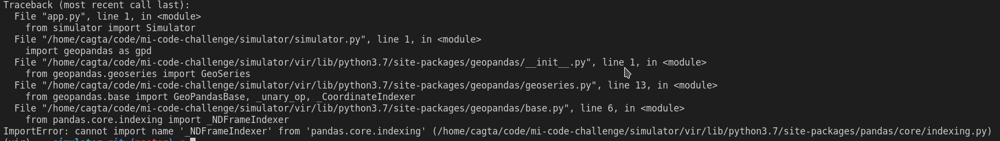

# MI Visualization Coding Challenge

This web application was written for [mi-code-challenge](https://github.com/door2door-io/mi-code-challenge). Don't forget to checkout [live demo](http://demo.cagataytanyildiz.com:3000/).

## **Modifications on Simulator**

Even if it's not permitted to introduction of **Simulator** at the provided repository, I have to use the latest version of geopandas instead of the provided ones. To test **Simulator** I used flowing code snippet.

```Python
from simulator import Simulator

bounding_box = (13.34014892578125, 52.52791908000258, 13.506317138671875, 52.562995039558004)
result = Simulator(bounding_box).simulate(10)

print(result)
```

When I try to use this snippet with the provided version of the Simulator following error poped up.



After couple of search on the internet I found that it's about the version of geopandas. So I decided to use latest version(0.8.1) instead of version 0.5.0. 

## **Architecture of the Web Application**

### Infrastucture
- **Docker**
    - both backend and frontend prepared as docker container for easy deploy.
- **Docker Compose**
    - since I'm dealing with more than one docker container, I decided to use docker-compose to deploy both of them at the same time.

### Backend
- **Flask**
- **pytest**
    - I mainly focused on building a solid base for testing instead of covering each cases.
    - Provided tests are prepared just to test this base.
- **geopandas**
    - This is required for Simulator.
- **waitress**
    - flask development server is not recommended for production usage. since this task requirement specificly mentioning that this will be considered as production ready application. I decided to switched flask development server with waitress.

### Frontend
- **React**
- **React Testing Library (Jest)**
    - Just like the backend my main consern is to show that I'm capable of building test base for unit tests. Since I don't have too much experience for frontend unittesting, I putted very basic tests as an example.
- **Nginx**
    - since this task requirement specificly mentioning that this will be considered as production ready application. I decided to use nginx to serve my React built.
- **React-Leaflet(v3) & Leaflet**
    - While I'm processing GeoJSON data which is very new to me, I searched companys github page as well as the contributer's of the coding challenge. At the end, I found React-Leaflet and Leaflet library for visualizing GeoJSON on map. And I even found some examples with React-Leaflet(v2) on one of the contributor's github [page](https://github.com/liman4u/mobility-intelligence-visualization). Since there is a newer version, I decided to go with it.
    - I added "@types/leaflet": "^1.5.19" into the package json so that I can built leaflet elements without having problem.

## **Enhancement points of the project**

### **Testing**
- Only the testing base was prepared with partial testing of the both frontend and backend.
- For frontend, api mocking and map layer testings can be added.

### **Installation**
- Production version is easy to use, development environment can be provided just like it. Only difference would be the docker volumes since I would like to keep the changes on the container on my host machine while developing.

### **Application**
- Currently everything relies on container. If the container is down then all the data was lost. This can be changed with docker volumes, so that each time that user runs the server they can access the old data.
- As I mentioned before, there is no old data on the system. As a result there is no comparing mechanism between different simulations.
